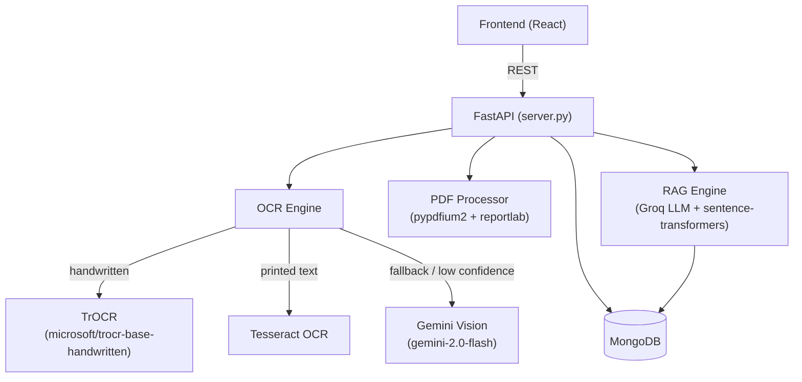

# ScribeAI

AI-powered OCR backend that converts handwritten notes and scanned documents into searchable, editable text — with RAG-based Q&A over your notes.

---

## Architecture



**Engine fallback chain:** TrOCR → Tesseract → Gemini (triggered when confidence < 60 %)  
**PDF handling:** text-layer extraction first; falls back to image OCR only when no selectable text exists.

---

## Features

- **Multi-engine OCR** — TrOCR for handwriting, Tesseract for printed text, Gemini Vision as a high-quality fallback
- **PDF processing** — extracts embedded text layers (instant, lossless) or renders pages for OCR
- **Batch PDF OCR** — sends all pages to Gemini in a single API call to reduce latency
- **Searchable PDF export** — saves original image with an invisible text layer for copy-paste
- **Folder & note management** — full CRUD with MongoDB storage
- **RAG Q&A** — ask natural language questions over your notes (Groq LLM + local embeddings)
- **Semantic re-indexing** — `/api/rag/reindex` generates embeddings for all existing notes
- **Image preprocessing** — contrast enhancement, denoising, binarisation for better OCR accuracy
- **Line segmentation** — splits full-page images into single-line crops before feeding TrOCR

---

## Prerequisites

| Dependency | Version | Notes |
|---|---|---|
| Python | 3.10 + | Tested on 3.12 |
| MongoDB | 6 + | Local or Atlas |
| Tesseract | 5 + | Add to `PATH` or set `TESSERACT_CMD` |
| CUDA (optional) | 11.8 + | For GPU-accelerated TrOCR |

---

## Setup

```bash
# 1. Clone and enter backend
git clone <repo-url>
cd ScribeAI/backend

# 2. Create and activate a virtual environment
python -m venv .venv
# Windows:
.venv\Scripts\activate
# macOS/Linux:
source .venv/bin/activate

# 3. Install dependencies
pip install -r requirements.txt

# 4. Configure environment
cp .env.example .env
# Edit .env with your API keys and MongoDB URL

# 5. Start the server
uvicorn server:app --reload --port 8001
```

The API will be available at `http://localhost:8001`.  
Interactive docs: `http://localhost:8001/docs`

---

## Environment Variables

| Variable | Required | Description |
|---|---|---|
| `MONGO_URL` | Yes | MongoDB connection string |
| `DB_NAME` | Yes | Database name (e.g. `scribeai`) |
| `GROQ_API_KEY` | Yes | For RAG Q&A (free at [console.groq.com](https://console.groq.com)) |
| `GEMINI_API_KEY` | No | Enables Gemini OCR engine (free at [aistudio.google.com](https://aistudio.google.com)) |
| `CORS_ORIGINS` | No | Comma-separated allowed origins (default: `*`) |
| `TESSERACT_CMD` | No | Full path to `tesseract` executable if not on `PATH` |

---

## API Reference

### OCR

| Method | Endpoint | Description |
|---|---|---|
| `POST` | `/api/ocr/upload` | Upload image or PDF; returns OCR text and file paths |
| `POST` | `/api/ocr/process` | Run OCR on an already-uploaded file path |
| `POST` | `/api/ocr/batch` | Upload and OCR multiple images at once |
| `GET` | `/api/images?image_path=<path>` | Serve a stored image to the frontend |

**Upload form fields:**

| Field | Type | Default | Description |
|---|---|---|---|
| `file` | File | — | Image (JPEG, PNG, GIF, WebP, BMP, TIFF) or PDF |
| `engine` | string | `auto` | `auto`, `trocr`, `tesseract`, or `gemini` |
| `language` | string | `eng` | Tesseract language code(s), e.g. `eng+hin` |
| `preprocess` | bool | `true` | Apply image enhancement before OCR |

Size limits: **20 MB** for images, **50 MB** for PDFs.

**Sample response:**
```json
{
  "success": true,
  "image_id": "d8790153-a9ab-4104-a334-490379d0d0ce",
  "original_path": "uploads/d8790153...png",
  "processed_path": "processed/d8790153..._processed.png",
  "is_pdf": false
}
```

### Notes

| Method | Endpoint | Description |
|---|---|---|
| `POST` | `/api/notes` | Create a note (stores text + embedding) |
| `GET` | `/api/notes` | List all notes; filter by `?folder_id=<id>` |
| `GET` | `/api/notes/{id}` | Get a single note |
| `PATCH` | `/api/notes/{id}` | Update title, text, folder, or tags |
| `DELETE` | `/api/notes/{id}` | Delete a note |

### Folders

| Method | Endpoint | Description |
|---|---|---|
| `POST` | `/api/folders` | Create a folder |
| `GET` | `/api/folders` | List all folders |
| `DELETE` | `/api/folders/{id}` | Delete folder (un-files its notes) |

### RAG Q&A

| Method | Endpoint | Description |
|---|---|---|
| `POST` | `/api/rag/query` | Ask a question about your notes |
| `POST` | `/api/rag/reindex` | Generate/refresh embeddings for all notes |

**Query body:**
```json
{
  "question": "What did I write about recursion?",
  "folder_id": null,
  "history": []
}
```

### PDF

| Method | Endpoint | Description |
|---|---|---|
| `POST` | `/api/pdf/generate` | Create a searchable PDF from image + text |
| `GET` | `/api/pdf/download/{filename}` | Download a generated PDF |

### Utility

| Method | Endpoint | Description |
|---|---|---|
| `GET` | `/api/health` | MongoDB status + OCR engine availability |
| `GET` | `/api/` | API version info |

---

## OCR Engines

| Engine | Best for | Notes |
|---|---|---|
| **TrOCR** | Handwritten text | Runs locally; uses line-segmentation + hallucination detection |
| **Tesseract** | Printed / typed text | Tries PSM 3, 6, 4 and picks the highest-confidence result |
| **Gemini Vision** | Complex layouts, mixed content | Requires `GEMINI_API_KEY`; used as fallback when confidence < 60 % |

---

## Running Tests

```bash
# From the repo root
pip install pytest
pytest backend/tests/ -v
```

Requires MongoDB running locally. Tests use the `scribeai_test` database (overriding `DB_NAME`).

---

## Known Limitations

- **CORS is wide open** (`*`) — tighten `CORS_ORIGINS` before deploying publicly
- **RAG similarity search** fetches up to 500 notes and computes cosine similarity in Python — not suitable for large corpora; consider Atlas Vector Search for scale
- **TrOCR** is CPU-only by default; a CUDA-enabled GPU will give ~10× speedup
- **Hindi PDF export** font support is a stub — replace the `try/pass` in `pdf_generator.py` with a Noto Devanagari font if needed

---

## Tech Stack

| Layer | Technology |
|---|---|
| API framework | FastAPI + Uvicorn |
| Database | MongoDB (Motor async driver) |
| OCR — handwriting | Microsoft TrOCR (Transformers) |
| OCR — printed | Tesseract 5 via pytesseract |
| OCR — vision LLM | Google Gemini 2.0 Flash |
| Embeddings | sentence-transformers (`all-MiniLM-L6-v2`) |
| LLM for RAG | Groq (`llama-3.1-8b-instant`) |
| PDF read | pypdfium2 |
| PDF write | ReportLab |
| Image processing | Pillow + OpenCV |
| Validation | Pydantic v2 |
